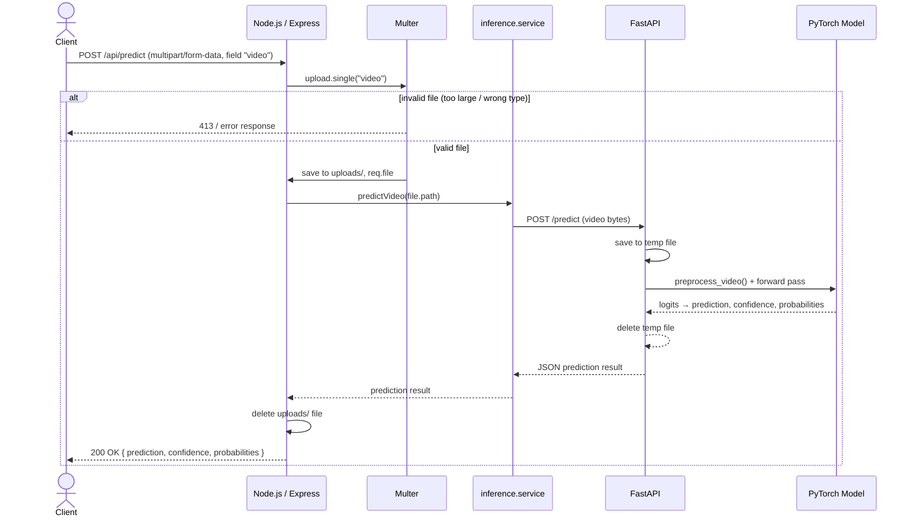

# RealVision Specification

## 1. Overview

RealVision is a backend API for deepfake video detection.

The user uploads a video file.  
The backend validates the file, stores it temporarily, sends it to a machine learning service, receives a prediction, and returns the result to the client.

---

## 2. Goals

The main goals of the project are:

- Accept a video upload from the client
- Validate the uploaded file
- Store the file temporarily
- Send the video to the ML inference service
- Receive a prediction from the model
- Return the prediction to the client as JSON

---

## 3. Non-Goals

The following are not part of the current version:

- User authentication
- Database storage
- User accounts
- Permanent video storage
- Complex frontend logic

---

## 4. System Architecture

The system is divided into two main backend parts.

### Node.js API

Node.js with Express is the main backend.

Responsibilities:

- Receive HTTP requests
- Handle video uploads
- Validate uploaded files
- Handle API errors
- Call the ML inference service
- Return the final response to the client

### ML Inference Service

FastAPI will be used as a separate Python service.

Responsibilities:

- Receive the video from the Node.js backend
- Prepare the video for the model
- Run the PyTorch deepfake detection model
- Return the prediction to the Node.js backend

### High-Level Flow

```text
Client
  ↓
Node.js / Express
  ↓
FastAPI
  ↓
PyTorch Model
  ↓
FastAPI
  ↓
Node.js / Express
  ↓
Client
```

### Sequence Diagram



---

## 5. Core Flow

1. The user uploads one video file.
2. The client sends a `POST` request to `/api/predict`.
3. The Node.js backend receives the request.
4. Multer handles the video upload.
5. The backend validates the uploaded file.
6. The file is stored temporarily.
7. The backend sends the video to the ML inference service.
8. The ML service processes the video using the deepfake detection model.
9. The ML service returns a prediction.
10. The Node.js backend returns the result to the client as JSON.

---

## 6. API Contract

### POST `/api/predict`

Uploads one video for deepfake analysis.

#### Request

Content type:

`multipart/form-data`

File field:

`video`

#### Current Upload Rules

- One video per request
- Maximum file size: 20MB
- Only video MIME types are accepted
- Files are stored temporarily in the `uploads/` folder

#### Example Success Response

Example:

```json
{
  "prediction": "fake",
  "confidence": 0.92,
  "probabilities": {
    "real": 0.08,
    "fake": 0.92
  }
}
```

---

## 7. Upload Handling

Multer is used to handle video uploads.

Current behavior:

- Uses disk storage
- Stores files in `uploads/`
- Creates a unique filename using a timestamp
- Accepts one uploaded file
- Limits file size to 20MB
- Performs basic video MIME type validation

The current MIME type check is only basic validation.  
Stronger file validation may be added later.

---

## 8. Component Responsibilities

### Route

The route defines the endpoint and middleware used for the request.

Example:

`POST /api/predict`

### Controller

The controller will handle HTTP-related logic.

Responsibilities:

- Read data from the request
- Check that the uploaded file exists
- Call the service layer
- Return the HTTP response

### Service

The service layer will handle the main application logic.

Responsibilities:

- Send the video to the ML service
- Receive the prediction
- Return the result to the controller

### FastAPI Service

The FastAPI service will handle model inference.

Responsibilities:

- Receive the video
- Preprocess it
- Run the model
- Return the prediction

---

## 9. Error Handling

Current planned error behavior:

- Missing video file → `400 Bad Request`
- File too large → `413 Payload Too Large`
- Invalid file type → client error
- Internal server error → `500 Internal Server Error`

More specific errors will be added as the project grows.

---

## 10. Open Design Decisions

Resolved:

- Video transfer from Node.js to FastAPI: `multipart/form-data` POST to `/predict`
- Video preprocessing: uniform sampling of 16 frames, center-crop + resize to 224x224 (see `preprocess.py`)
- Frame selection: uniform strategy over the full video (random strategy also implemented but unused)
- Prediction response structure: `{ prediction, confidence, probabilities }`

Still open:

- Timeout behavior
- Temporary file cleanup strategy (currently deleted after each request; no retry/failure handling)
- Maximum allowed video duration

---

## 11. Future Improvements

Possible future improvements:

- Automated tests
- Better file validation
- Request logging
- Request IDs
- Rate limiting
- Timeout handling
- Temporary file cleanup
- Better error responses
- Deployment configuration
- Monitoring
